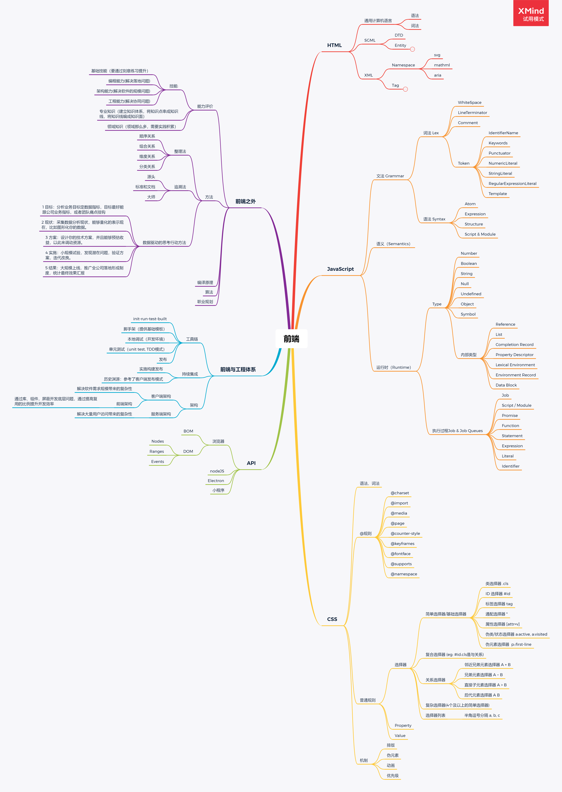

# 每周总结可以写在这里
## 一、搭建自己的前端知识架构
### 必要性
纲举目张，如果知识乱糟糟的没有成体系，想要用时或学习新知识时就会事倍功半。就像一个屋子里面的东西如果乱糟糟的，不论找东西还是放东西都很困难。
### 内容
以保证知识整体的完备性的前提下，设计前端知识架构。
[xmind思维导图](./前端技术知识体系.xmind)

## 二、前端工程体系
### 工具链
* init 脚手架（提供基础模板）---
* run 本地调试（开发环境）
* test 单元测试（unit test, TDD模式）mocha chai等等
* built 发布
  * 持续集成 CI
  * 持续交付 CD
### 架构
* 客户端架构
  * 解决软件需求规模带来的复杂性
  * 前端架构
    * 通过库、组件、框架，屏蔽开发底层问题，通过提高复用的比例提升开发效率
* 服务端架构
  * 解决大量用户访问带来的复杂性
### 实现目标推动事情的方法
* 设定目标：目标最好能跟公司业务指标，或者团队痛点挂钩
* 分析现状：能够量化的表示现在的现状。比如图形化你的数据
* 技术方案：设计你的技术方案，并且能够预估收益，以此来调动资源
* 小规模实施：发现潜在问题，验证方案
* 迭代改良：大规模上线