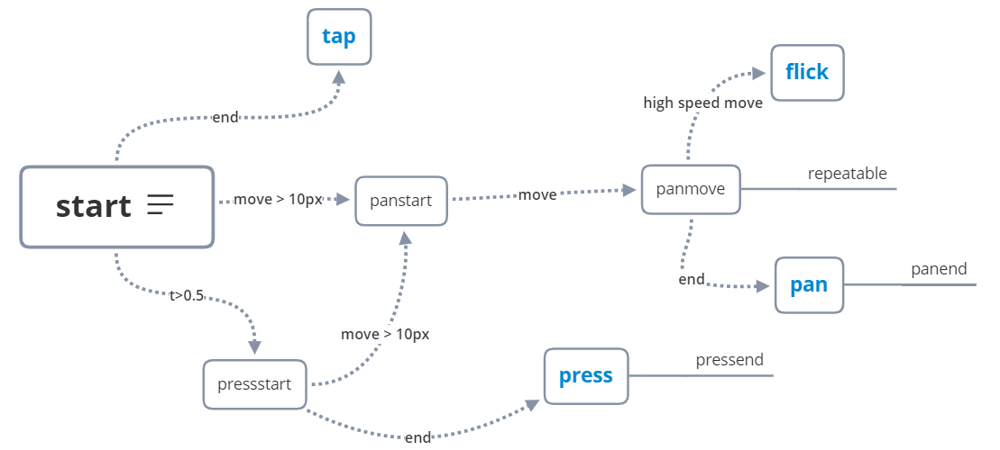

# 16周 手势与组件化

## 常用手势

- Tap(手往屏幕上面点)
- Pan(手指拖拽)
- Flick(快速点)
- Press(点后较长时间离开屏幕)
  

## 鼠标事件与触屏事件的合并

1. 监听鼠标
   - mousedown -> [mousemove ->] mouseup
2. 监听触屏
   - 增加的数据结构
      - identifier 识别是哪个 touch
      - changedTouches 保存touch变化序列
   - 需要监听的事件
      - touchstart
      - touchmove
      - touchend
      - touchcancel
         - 系统弹窗之类会触发 touchcancel
         - 与 touchend 只会触发一个
3. 通过抽象，统一鼠标和触屏事件

参考链接
1. [DOM Events](https://developer.mozilla.org/en-US/docs/Web/Events)
2. [Creating and triggering events](https://developer.mozilla.org/en-US/docs/Web/Guide/Events/Creating_and_triggering_events)
